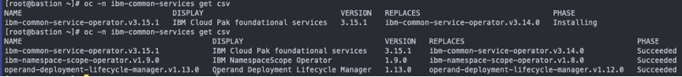

# MAS Core installation
All mentioned in the project files examples you can find in the mas folder.  
All ansible playbooks were taken from [MAS Devops Ansible Collection](https://ibm-mas.github.io/ansible-devops/)

### Have at hand:
- **IBM entitlement key**[ You can dowload here](https://myibm.ibm.com/products-services/containerlibrary)


- **MAS License file**  
--IBMers can generate file [here](https://www.ibm.com/support/pages/ibm-support-licensing-start-page)  
--BPs – [PartnerWorld](https://www.ibm.com/partnerworld/public)
## Prerequisites
Create two subfolders in your home folder, the one from which you will issue shell commands, e.g.:
- **mas** – for playbooks and YAML files; copy here files from the mas folder of the project – playbooks and YAML
- **masconfig** – for MAS configuration files created by ansible playbooks which automate the configuration of subsequent playbooks; copy MAS license file to the folder  
  
You can create folders with the command:
```bash
mkdir {mas,masconfig}
```
### Installation of Python, Ansible and Ansible Galaxy collection
Prerequisite is to have installed Python 3.8.
1. Install Ansible with the command:  
```bash
python -m pip install ansible openshift==0.11.2
```
2. Install Ansible Galaxy collection with the command:  
```bash
ansible-galaxy collection install ibm.mas_devops
```
More details [here](https://ibm-mas.github.io/ansible-devops/)

### IBM Operator Catalog Activation
1. Enable catalog with the command:  
```bash
oc apply -f mas/catalog_source.yaml -n openshift-marketplace
```
2. Check result with the command (it could take a few minutes )  
```bash
oc get CatalogSources ibm-operator-catalog -n openshift-marketplace
```
More details [here](https://github.com/IBM/cloud-pak/blob/master/reference/operator-catalog-enablement.md)  
| NOTICE |
| --- |
|If you don't have experience with Ansible, don't worry in case of any problems (mostly readiness checking tasks if your OCP cluster or internet connection are slow). Ansible playbooks, tasks are idempotent it means you can run them many times against the same host and it is completely safe!|

### MongoDB
1. #### Customize ~/mas/mongo.yaml file
```yaml
- hosts: localhost
  any_errors_fatal: true
  vars:
    mongodb_storage_class: rook-ceph-block # storageclass available on your OpenShift (RWO)
    mas_instance_id: masinst1 # MAS instance name -  what you prefer
    mas_config_dir: ~/masconfig # folder where configuration files will go
  roles:
    - ibm.mas_devops.mongodb
```
Customize parameters:  
 - **mongodb_storage_class** - storageclass available on your OpenShift (RWO)  
 - **mas_instance_id** - MAS instance name -  what you prefer  
 - **mas_config_dir** -  folder where configuration files will go  
2. #### Install MongoDb with the command:  
```shell
ansible-playbook mas/mongo.yaml
```
As a result, you get working mongo cluster and file with configuration mongo-mongoce.yml in masconfig subdirectory.  
Instalatin sesssion:  
- [picture](../img/mongo.png)
- [video](https://youtu.be/gf5XaOhh62Q)

### IBM Certificate Manager
With MAS 8.6 you could install it in very simple way, because the lowest supported versions is 1.1:
```shell
oc new-project cert-manager
oc apply -f https://github.com/jetstack/cert-manager/releases/download/v1.2.0/cert-manager.yaml
```
With MAS 8.7 you must have 1.5. (It would be great if ansible for SLS installation did this ;-), but for now ... )
```shell
oc apply -f mas/def.yaml
```
Wait until operator is available (not long). Check it with command:
```shell
oc -n ibm-common-services get csv
```
  

If PHASE is Succeeded run the command:
```shell
oc apply -f mas/certman.yaml
```
### IBM Suite License Service
1. Customize ~/mas/sls.yaml file
```yaml
hosts: localhost
  any_errors_fatal: true
  vars:
    sls_catalog_source: "{{ lookup('env', 'SLS_CATALOG_SOURCE') | default('ibm-operator-catalog', true) }}"
    sls_channel: "{{ lookup('env', 'SLS_CHANNEL') | default('3.x', true) }}"
    sls_namespace: "{{ lookup('env', 'SLS_NAMESPACE') | default('ibm-sls', true) }}"
    sls_icr_cp: "{{ lookup('env', 'SLS_ICR_CP') | default('cp.icr.io/cp', true) }}"
    sls_icr_cpopen: "{{ lookup('env', 'SLS_ICR_CPOPEN') | default('icr.io/cpopen', true) }}"
    sls_instance_name: "{{ lookup('env', 'SLS_INSTANCE_NAME') | default('sls', true) }}"
    sls_entitlement_username: "{{ lookup('env', 'SLS_ENTITLEMENT_USERNAME') | default('cp', true) }}"
    sls_entitlement_key:  # your entitlement here
    sls_storage_class: rook-ceph-block # your storageclass
    sls_domain: apps.ocp3.hdmasdemo.pl # your domain
    mas_instance_id: masinst1 # MAS instance name which you has chosen during the mongo installation
    mas_config_dir: ~/masconfig
    sls_cfg_file: "{{ mas_config_dir }}/sls.yml"
    mongodb_cfg_file: "{{mas_config_dir}}/mongo-mongoce.yml"
    bootstrap:
      license_id: da5dc3b8762b # your licence id
      registration_key: "{{ lookup('env', 'SLS_REGISTRATION_KEY') | default('', true) }}"
      entitlement_file: "{{mas_config_dir}}/license.dat" # your licence file in masconfig folder
  roles:
    - ibm.mas_devops.sls_install
```
Customize parameters:  
 - **sls_entitlement_key** - your ibm entitlement key
 - **mongodb_storage_class** - storageclass available on your OpenShift (RWO)  
 - **sls_domain** - the domain of your OpenShift cluster  
 - **mas_instance_id** - MAS instance name which you has chosen during the mongo installation
 - **mas_config_dir** -  folder where configuration files will go 
 - **license_id** - id from your license file  
 - **entitlement_file** -  your licence file   
2. Install SLS with the command:  
```shell
ansible-playbook mas/sls.yaml
```
Instalatin sesssion:  
- [video](https://youtu.be/KWuLBe8RRXk)
