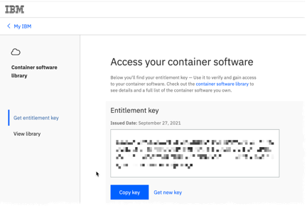

# MAS Manage installation
All mentioned in the project files examples you can find in the mas folder.  
All ansible playbooks were taken from [MAS Devops Ansible Collection](https://ibm-mas.github.io/ansible-devops/)

### Have at hand:
- **IBM entitlement key**[ You can dowload here](https://myibm.ibm.com/products-services/containerlibrary)


- **MAS License file**  
--IBMers can generate file [here](https://www.ibm.com/support/pages/ibm-support-licensing-start-page)  
--BPs – [PartnerWorld](https://www.ibm.com/partnerworld/public)
## Prerequisites
Create two subfolders in the folder from which you will issue shell commands, e.g.:
- **mas** – for playbooks and YAML files; copy here files from the mas folder of the project – playbooks and YAML
- **masconfig** – for MAS configuration files created by ansible playbooks which automate the configuration of subsequent playbooks; copy MAS license file to the folder
You can create folders with the command:
```bash
mkdir {mas,masconfig}
```
### Installation of Python, Ansible and Ansible Galaxy collection
Prerequisite is to have installed Python 3.8.
- Install Ansible with the command:  
```bash
python -m pip install ansible openshift==0.11.2
```
- Install Ansible Galaxy collection with the command:  
```bash
ansible-galaxy collection install ibm.mas_devops
```
More details [here](https://ibm-mas.github.io/ansible-devops/)

### IBM Operator Catalog Activation
- Enable catalog with the command:  
```bash
oc apply -f catalog_source.yaml -n openshift-marketplace
```
- Check result with the command (it could take a few minutes )  
```bash
oc get CatalogSources ibm-operator-catalog -n openshift-marketplace
```
More details [here](https://github.com/IBM/cloud-pak/blob/master/reference/operator-catalog-enablement.md)
