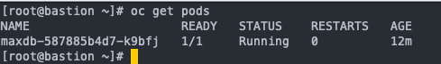

### MAS Manage installation
You can install various MAS applications using Ansible playbooks provided by MAS Devops Collection e.g Manage- [steps here.](https://ibm-mas.github.io/ansible-devops/playbooks/lite-manage-roks/)  
If you prefer manual installation, you can look [here.](https://pages.github.ibm.com/maximoappsuite/deployment-guide/install/cloudpak-for-data)  
If your infrastructure is insufficient for using CP4D and DB2 Warehouse cluster and you are determined to have MAS Manage, you can choose the below way with a standard db2 docker image.  
  
There are videos showing how to install and configure MAS Manage in case you already have database (not necessarily db2) prepared.  
- **MAS Manage Installation Deployment Part 1** [video](https://www.youtube.com/watch?v=L5J370gslw8)  
- **MAS Manage Deployment and Activation Installation Part 2** [video](https://www.youtube.com/watch?v=4xFlrfXxpdg)  
- **MAS Manage Validate Installation Login as Maxadmin Part 3** [video](https://www.youtube.com/watch?v=nm31i5g4rbs)  

So as you can see there are enough materials available on how to install MAS Manage and I am not going to duplicate them, but I only want to show you how can you spare hardware using a small DB2 instance on OpenShift.  
Of course, such an approach is not recommended for production environment purposes but only for test or development.

|NOTICE|
|------|
|Remember that you have to be logged in to OpenShift|
1.  **Create db2 objects with the provided script**  
Start the script with the command:  
(alternatively you can set an executable flag with _chmod +x mas/db2-maxdb.sh_ command and run _mas/db2-maxdb.sh_):
```bash
source mas/db2-maxdb.sh
```
Wait until the db2 pod is in running status.  

  

```yaml
  - env:
          - name: DB2INST1_PASSWORD
            value: passw0rd
```
You can change the password for db2inst1 user in db2-maxdb.yaml file, look at excerpt above. Of course, you have to do that before running _source db2-maxdb.sh_.  

2. **Set the _/database_ folder ownershipp**  

- Open rsh session with the command:
```bash
oc rsh $(oc get pod -o jsonpath="{.items[].metadata.name}")
```
- Set the ownerships and flags:  
```bash
chown -R db2inst1:db2iadm1 /database
chown root /database/config/db2inst1/sqllib/security/db2chpw
chown root /database/config/db2inst1/sqllib/security/db2ckpw
chmod u+s /database/config/db2inst1/sqllib/security/db2chpw
chmod u+s /database/config/db2inst1/sqllib/security/db2ckpw
```
- Switch to user db2inst1 with the command:  
```bash
su - db2inst1
```
- start instance:  
```bash
db2start
```
- End rsh session:  
```bash
exit
exit
```
3. **Configure db2**  
- Copy ~/mas/db2onfig.sh file to db2 pod with the command:  
```bas
oc cp mas/db2config.sh $(oc get pod -o jsonpath="{.items[].metadata.name}"):/tmp
```
- Open rsh session with the command:
```bash
oc rsh $(oc get pod -o jsonpath="{.items[].metadata.name}")
```
- Switch to user db2inst1 with the command:  
```bash
su - db2inst1
```
- Run configuration script with the command:
```bash
source /tmp/db2config.sh
```
- End rsh session:  
```bash
exit
exit
```
More details [here](https://www.ibm.com/docs/en/maximo-manage/8.2.0?topic=deployment-configuring-db2)  
Configuration session [video](https://youtu.be/gceanvUZLH8)  

4. **Complete the setup** according to the videos at the top of the page.
